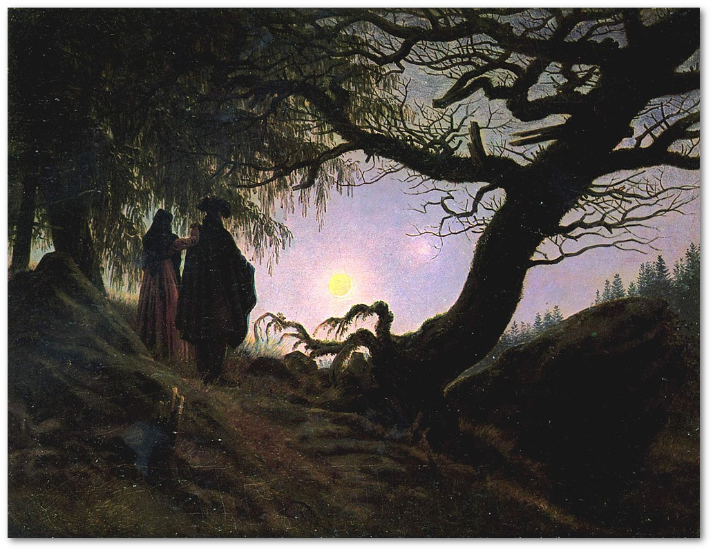
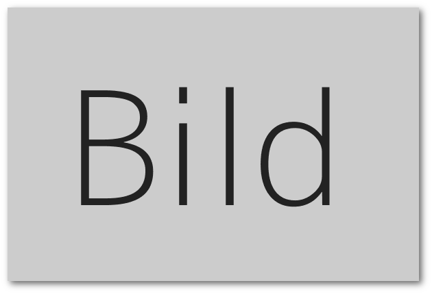

```{=latex}
\hyphenation{
  kom-mu-ni-ka-tions-wis-sen-schaft-li-che
}
```

# Formaler Aufbau

Auf dem Weg ein formal ordentliches, den akademischen Gepflogenheiten des Fachs entsprechendes und visuell ansprechendes Dokument zu erzeugen, will Sie dieser Leitfaden begleiten.


## Textumfang

Vorbehaltlich abweichender Vorgaben im Rahmen einzelner Lehrveranstaltungen, gelten folgende Richtwerte für den Umfang der Arbeiten. Die Angaben verstehen sich inklusive Leerzeichen und Fußnotenapparat; nicht mitgezählt werden das Deckblatt sowie automatisiert erstellte Inhalte, wie beispielsweise Inhalts-, Abbildungs-, oder Literaturverzeichnis:

* B.&#8239;A.-Module M12, M13, M16: 25&#8239;000 Zeichen
* B.&#8239;A.-Module M19, M20: 40&#8239;000 Zeichen
* M.&#8239;A.-Module: 40&#8239;000 Zeichen
* Bachelorarbeit: 60&#8239;000 Zeichen
* Masterarbeit: 120&#8239;000 Zeichen


## Segmente der Arbeit

Feste Bestandteile einer schriftlichen Arbeit sind Titelblatt, Inhaltsverzeichnis, Einleitung, Hauptteil, Schlussbetrachtung und Quellenverzeichnis; fallweise kommen weitere Anhänge (z.&#8239;B. ein Abbildungsverzeichnis) hinzu. Fügen Sie Ihren schriftlichen Arbeiten zudem eine Erklärung zu Redlichkeit und Rechtsfolgenkenntnis bei.


### Deckblatt

Auf Ihrem Deckblatt erfüllen Sie formale Notwendigkeiten hinsichtlich der Angaben zu Ihrer Arbeit und Person. Mit Ihrer Fragestellung und ggfs. einem Untertitel beginnt Ihre schriftliche Arbeit.

Die notwendigen Angaben für schriftliche Arbeiten allgemein und Abschlussarbeiten im Speziellen finden Sie als Muster auf den Seiten ii und iii. Die Gestaltung können Sie natürlich anpassen, die Wiedergabe der jeweiligen Informationen ist jedoch verbindlich.


<!--

| Seminararbeit         |                Abschlussarbeit |
|-----------------------|-------------------------------:|
| Fragestellung/Titel   |            Fragestellung/Titel |
|                       |                    Universität |
|                       |                       Fakultät |
|                       |                      Lehrstuhl |
| Verfasser             |                      Verfasser |
| (Name, Matrikelnr.)   | (Name, Anschrift, Matrikelnr.) |
| Semester              |                                |
| Modul                 |                                |
| Veranstaltung         |                                |
| Lehrperson            |           Erst-/Zweitgutachter |
| FlexNow-Prüfungsdatum |                    Abgabedatum |

-->

### Inhaltsverzeichnis

Nummeriert wird in Form der Dezimalgliederung. Mehr als drei nummerierte Gliederungsebenen sind zu vermeiden. Das Muster finden Sie auf Seite iv. Es empfiehlt sich, die Gliederung der Arbeit automatisiert mithilfe des verwendeten Textverarbeitungsprogramms zu erstellen.


### Einleitung

Die Einleitung ist als integraler Bestandteil der Arbeit zu sehen und soll dem Lesenden/Prüfenden die Forschungsfrage, den Gegenstand der Arbeit und die Methodik aufzeigen; das Ziel der Arbeit sowie der inhaltliche Aufbau werden hier erläutert.


### Hauptteil

~~Der Hauptteil Ihrer Arbeit~~. Verwenden Sie *sprechende Überschriften*, d.&#8239;h. auf den Inhalt des jeweiligen Abschnitts hinweisende Überschriften; keine Überschriften wie *Hauptteil* oder *Kapitel 1*. Die inhaltlichen Wege der Bearbeitung werden durch die Frage- oder Aufgabenstellung definiert sowie durch mögliche Vorgaben der Dozierenden.  

### Schluss

~~Im Schluss Ihrer Arbeit führen Sie Ihre Ergebnisse zusammen~~. Hier besteht zudem Raum für ~~ausblickartige~~ Anknüpfungspunkte hinsichtlich der bearbeiteten Forschungsaufgabe/-frage und bzgl. weiterer, kritischer Kontextualisierung. Auch hier sollte die Überschrift dem Inhalt nach gewählt werden.

### Quellenverzeichnis

Hier werden alle in Ihrer Arbeit verwendeten Werke mit deren bibliografischen Details verzeichnet. Ein sorgfältiges Erstellen ist verbindlich, dient der Überprüfbarkeit und zeigt Ihre akademische Sorgfalt.

~~Alle verwendeten Quellen sind von Ihnen auf deren Geeignetheit~~ hin überprüft und ausgewählt worden. Die nötige Untergliederung des Quellenverzeichnisses in ein Literaturverzeichnis und ein Verzeichnis für weitere alphabetisch sortierte Quellen (Fotografien, Gemälde, Filme, ...) ist abhängig von der Quellenlage zu wählen. Die Gestaltunsgrichtlinien dazu finden Sie unter Punkt 2, das Musterbeispiel ab Seite 13.

### Erklärung

Fügen Sie am Ende Ihrer Arbeit eine unterschriebene Erklärung bzgl. Redlichkeit und Rechtsfolgenkenntnis bei. Als verbindliche Vorlage dient die letzte Seite dieser Gestaltungsrichtlinien.

Beachten Sie für Abschlussarbeiten auch immer die Hinweise auf den Seiten des Prüfungssekretariats Geisteswissenschaften unter „Allgemeine Informationen und Bekanntmachungen | Abschlussarbeit“:  
[https://www.ur.de/studium/pruefungsverwaltung/geisteswissenschaften](https://www.ur.de/studium/pruefungsverwaltung/geisteswissenschaften).


## Seitenlayout und Typografisches

~~Satz~~^[Darüber hinausgehende Informationen zu orthografisch richtiger und typografisch ansprechender Gestaltung schriftlicher Arbeiten finden sie z.&#8239;B. in „Typokurz -- Einige wichtige typografische Regeln“ bei @bi:2009.]

-   Die Arbeit wird einseitig auf DIN A4-Papier gedruckt.
    Die Seitenränder betragen: oben 3cm, unten 3,8cm,
    links 3,2cm und rechts 3cm.
-   Die Schriftgröße beträgt üblicherweise 12pt;
    der Lesbarkeit wegen und nach Laufweite der
    jeweils verwendeten Schrift.
-   Verwenden Sie 1,2fachen Zeilenabstand.
-   Für den Fließtext verwenden Sie Blocksatz mit
    automatischer Silbentrennung.
-   Überschriften werden grundsätzlich linksbündig gesetzt
    (ohne Blocksatz).
-   Textauszeichnungen, wie beispielsweise Kursivierung
    und Fettdruck, sind so oft wie nötig, jedoch nicht
    inflationär zu gebrauchen.
-   Für Ihre Arbeit verwenden Sie vorzugsweise
    eine Serifenschrift; die [Vollkorn](http://vollkorn-typeface.com/)^[Näheres zur Schrift *Vollkorn* finden Sie unter [http://vollkorn-typeface.com/](http://vollkorn-typeface.com/)] kommt beispielsweise in diesem Dokument zum Einsatz.


# Zitierrichtlinien und Vorgaben zur Erstellung des Quellenverzeichnis

Das Quellenverzeichnis besteht aus einem alphabetisch geordneten Literaturverzeichnis (Bibliographie) und je nach weiteren verwendeten Quellen einem Bild- Bewegtbild-, Filmverzeichnis etc.

Hier evtl. nicht aufgeführte Quellenarten sollen auch adäquat zitiert werden; dazu selbständig bei Bedarf z.&#8239;B. den *Chicago Manual of Style* online zu rate ziehen.


## Allgemeines zur Zitation

>„Jede von anderen Autoren wörtlich in die eigene Arbeit übernommene Textpassage und jede sich an die Gedankengänge anderer Autoren eng anlehnende Stelle der Arbeit ist **einzeln** zu kennzeichnen und durch eine **genaue Quellenangabe** zu belegen. [...] Wer einen fremden Text **wörtlich** oder **sinngemäß** in seine wissenschaftliche Arbeit übernimmt, ohne ihn entsprechend zu markieren, macht sich des **Plagiates** schuldig [...].“ ^[@brink:2013 [195]; Hervorhebungen im Original.]

Grundsätzlich lassen sich zwei Arten von Zitaten unterscheiden: das wörtliche oder direkte Zitat und das indirekte Zitat. Sollten wörtliche Zitate über mehr als drei Zeilen gehen, werden diese links eingerückt und mit geringerem Schriftgrad (10pt) gesetzt.

Wird von Ihnen nicht wörtlich zitiert, sondern paraphrasiert, machen Sie dies im Kurzbeleg auch deutlich und stellen ein „Vgl.“ voran; je nach Formulierung des Umfelds auch unabgekürzt. Ein Beispiel: Laut den Autoren haben Filme und Serien eine wichtige Funktion für die Positionierung der Programme.^[~~Vgl. @we:2000 [61].~~]


Die ~~Belege~~ werden als ~~**Kurzform (Kurztitel)**~~ in eine Fußnote geschrieben, bei Bildern direkt in die Abbildungsbeschriftung integriert. Die dazugehörige Langform wird am Ende der Arbeit in einem **Quellenverzeichnis** geführt.


Die Anleitung zur korrekten Darstellung von Kurztitel und Langform im Quellenverzeichnis für ~~Literatur, Bilder, Video etc.~~ finden sie im folgenden Teil der Gestaltungsrichtlinien.


## Fußnoten

In Fußnoten sollen, neben weiterführenden Gedanken, die dort auch ihren Platz finden können, die ~~Kurztitel~~ von wörtlichen oder indirekt verwendeten Quellen zu finden sein. Alle Fußnoten beginnen mit einem Großbuchstaben und werden mit einem Punkt abgeschlossen. Für die genaue Platzierung der Verweisziffer im Text gilt folgende Regel:

> „Bezieht sich die Fußnote auf ein einzelnes Wort oder eine Wortgruppe, steht die Fußnotenziffer direkt dahinter noch vor einem folgenden Satzzeichen. Wenn sie sich jedoch auf einen ganzen Satz oder durch Satzzeichen eingeschlossenen Satzteil bezieht, steht sie nach dem schließenden Satzzeichen.“^[@an:2000 [99].]

Bei Verweis auf ein Buch, Zeitschrift o. ä., wird in der Fußnote folgende Kurzreferenz verwendet^[~~Zur Verwendung von „f.“ und „ff.“ bei Seitenangaben beispielhaft Folgendes: @em:2005 [32ff.]~~]: **Nachname(n) (Erscheinungsjahr, ggf. Seitenzahl)**.
⇒ Nachname(n) (Erscheinungsjahr, ggf. Seitenzahl).

~~Erstreckt sich die zitierte Stelle über zwei Seiten, so kann dies mit dem Zusatz „f.“ dargestellt werden. Bei mehreren folgenden Seiten, wird der Zusatz „ff.“ verwendet. Beispiel: @em:2005 [32ff.].~~

Sie finden im Folgenden bei allen im Zitierstil beschriebenen Arten von Quellen die dazugehörige Form des Kurztitels für die Fußnoten.


## Bilderverwendung

Im Text ...

~~Abbildungsverzeichnis~~

Bei einer größeren Anzahl von im Text verwendeten Abbildungen, kann ein Abbildungsverzeichnis vor dem Quellenverzeichnis dem Lesenden nützlich sein. Dort werden die laufende Abbildungsnummer, die ggf. gekürzte Bildunterschrift und die Seitenangabe genannt.

![Schematische Zeichnung einer portablen *camera obscura* nach @za:1685 [181].](eigene-dateien/cam.jpg){width=66%}

{width=66%}

Im Quellenverzeichnis und dort beim Unbewegt- und Bewegtbildverzeichnis steht dann ausführlich:

Mann und Frau den Mond betrachtend (1818–1824). Caspar David Friedrich.
Alte Nationalgalerie Berlin.

@cas:1818


## Zitierstil

### Druckwerke

**Monografien:**

<!--Muster: \[Nachname, Vorname (Jahr). *Titel. Untertitel*. Ort: Verlag.\]-->


\bibstart
\voll Dotzler, Bernhard J. & Roesler-Keilholz, Silke (2017). *Mediengeschichte als Historische Techno-Logie*. Baden-Baden: Nomos.
\bibend

\kurz @doro:2017

<!--
\bibstart
\voll Sloterdijk, Peter (1999). *Regeln für den Menschenpark. Ein Antwortschreiben zu Heideggers Brief über den Humanismus*. Frankfurt am Main: Suhrkamp.
\bibend

\kurz @sl:1999 [10].
-->


**Herausgeberschaft:**

\bibstart
\voll Heibach, Christiane & Rohde, Carsten (Hg.) (2015). *Ästhetik der
Materialität* (= HfG Forschung, 6). München: Fink.
\bibend

\kurz @hero:2015

**Wissenschaftliche Fachzeitschriften:**

<!--Muster: \[Nachname, Vorname (Jahr). Titel. Untertitel. In: *Titel. Untertitel.* Jahrgang, Nummer, Seitenraum.\]-->

Stegbauer, Christian & Rausch, Alexander (2001). Die schweigende Mehrheit: »Lurker« in internetbasierten Diskussionsforen. In: *Zeitschrift für Soziologie.* 30, Nr. 1, S.&#8239;48--64.

⇒ Vgl. @st:2001 [48].


**Sammelbände:**

<!-- Muster: \[Nachname, Vorname (Jahr). Titel. Untertitel. In: Nachname, Vorname (Hg.). *Titel. Untertitel.* Ort: Verlag, Seitenraum.\] -->

Gerhards, Jürgen & Neidhardt, Friedhelm (1993). Strukturen und Funktionen moderner Öffentlichkeit. In: Langebucher, Wolfgang R. (Hg.). *Politische Kommunikation: Grundlagen, Strukturen, Prozesse.* Wien: Braumüller, S.&#8239;52--89.

⇒ Vgl. @ge:1993 [60f.].

Wurde ein Werk von mehr als drei Autoren verfasst, wird der Hauptautor genannt und weitere Koautoren unter »et al.« zusammengefasst; z.&#8239;B.:

Amento, Brian et al. (2003). Experiments in social data mining: The TopicShop system. In: *ACM Transactions on ComputerHuman Interaction (TOCHI).* 10, Nr. 1, S.&#8239;54--85.

**Kurztitel im Text/Fußnote:**

**Nachname (Jahr, ggf. Seitenzahl).** =\> Amento et al. (2003, S.&#8239;54--85).

⇒ @am:2003 [60].

### Online-Quellen

**Artikel**

**Nachname, Vorname (Jahr). *Titel. Untertitel*. [url:]{.smallcaps} [http://www.xyz.de](http://www.xyz.de) -- Zugriff: Tag.Monat.Jahr.**

O'Reilly, Tim (2005). *What Is Web 2.0*. [url:]{.smallcaps} [http://www.oreillynet.com/lpt/a/6228](http://www.oreillynet.com/lpt/a/6228) -- Zugriff: 4.2.2014.

⇒ @or:2005.

**Videos** (z.&#8239;B. Youtube, Vimeo) -- abweichende Angaben bei Musikvideos (s.u.)!

**Nachname, Vorname \[Benutzername\] (Veröffentlichungsdatum). *Videotitel* \[Video file\]. [url:]{.smallcaps} [http://www.xyz.de](http://www.xyz.de) -- Zugriff: Tag.Monat.Jahr.**

Cook, Shelby \[XxSourGummyBearzxX\] (16.12.2013). *Tom Hiddleston Funny Moments* \[Video file\]. [url:]{.smallcaps} [http://www.youtube.com/watch?v=kXViNegXPTk](http://www.youtube.com/watch?v=kXViNegXPTk) -- Zugriff: 4.2.2014.

Wenn der Name eines Benutzers nicht zu recherchieren ist, wird der Benutzername ohne Klammern als Name verwendet. Analog gilt bei nicht möglicher Zuweisung von Autorenname und Erscheinungsdatum »o.&#8239;A.« und »o.&#8239;J.« zur Kenntlichmachung.

**Benutzername (Veröffentlichungsdatum). *Videotitel* \[Video file\]. [url:]{.smallcaps} [http://www.xyz.de](http://www.xyz.de) -- Zugriff: Tag.Monat.Jahr.**

**Musikvideos:** (z.&#8239;B. Youtube, Vimeo)

**Interpret (Erscheinungsjahr). *Musikvideo-Originaltitel* (Produktionsgesellschaft, ggf. Regisseur).**

Björk (1999). *All is full of love* (Electra Entertainment Group Inc., Chris Cunningham).

**Wikipedia**

**Wikipedia-Seitentitel (Datum der letzten Bearbeitung). In: *Wikipedia -- Die freie Enzyklopädie.* [url:]{.smallcaps} [http://www.xyz.de](http://www.xyz.de) -- Zugriff: Tag.Monat.Jahr.**

Wikipedia-Zitierfähigkeit (8. November 2013). In: *Wikipedia -- Die freie Enzyklopädie.* [url:]{.smallcaps} [http://de.wikipedia.org/w/index.php?title=Zitierf%C3%A4higkeit&oldid=60350199](http://de.wikipedia.org/w/index.php?title=Zitierf%C3%A4higkeit&oldid=60350199) -- Zugriff: 4.2.2014.

Der **Permanentlink** zu einem Wikipedia-Artikel findet sich auf der linken Seite der Webseite unter „Werkzeuge“. Bei Webinhalten die einer Versionierung unterliegen, verwiest dieser immer auf die zum Zeitpunkt der Zitierung gültige Fassung des elektronischenDokuments, selbst wenn im Nachhinein aktuellere Fassungen hinzugekommen sind. Die Seiteninformationen (Datum der letzten Bearbeitung, etc.) finden sich auch auf der linken Seite unter „Werkzeuge/Seite zitieren“.

**Kurztitel im Text/Fußnote:**

**Nachname bzw. Interpret (Erscheinungsjahr).** =\> Björk (1999).

**Wikipedia-Seitentitel (Datum der letzten Bearbeitung).** =\> Wikipedia-Zitierfähigkeit (8. November 2013).

⇒ @wikizit:2019.

### Film/Bilder/Photos

Die Zitationsweise von Bildern unterscheidet sich in bewegte (z.&#8239;B. Film) und unbewegte Bilder (z.&#8239;B. Gemälde, Fotografien).

Länderkennung nach `ISO 3166-1 Alpha 2`.

***Film-Originaltitel* (ggf. deutscher Titel, Land bzw. Länder in denen der Film etc. produziert wurde, Regisseur, Verwendetes Trägermedium).**

*A Woman's Face* (Die Frau mit der Narbe, USA 1941, Georges Cukor, DVD).

saasdasd

@wom:1941

sesdfwe

***Unbewegtbild-Originaltitel* (ggf. deutscher Titel, Künstler, Entstehungsjahr).**

{width=66%}


*Larmes* (Tränen, Man Ray, 1930). In: Rosalind Krauss, Jane Livingston (Hg.): L'amour fou. Photography and Surrealism. Washington/New York 1985. S.&#8239;118.


@ray:1932


In der **Bibliographie** werden unter dem Punkt **Quellenverzeichnis für Film/Bilder** die verwendeten Filme und/oder Bilder in alphabetischer Reihenfolge sortiert.

**Kurztitel im Text/Fußnote:**

**Filme** werden **im Text** nach folgender **Kurzform** genannt:

***Originaltitel.* (Produktionslandkürzel + Jahr).** =\> *Le Mepris.* (F/I 1963).

Dabei ist zu beachten, dass der Filmtitel kursiv gesetzt wird. Die Produktionsdaten von Filmen können zum Beispiel bei [imdb, The Internet Movie Database](https://www.imdb.com) abgefragt werden.

Bildunterschriften von Einzelkadern (Stills) aus Filmen etc., die der Illustration dienen, sind um den genauen Timecode des Einzelkaders zu ergänzen (jeweils zweistellig für Stunden, Minuten, Sekunden).

*A Woman's Face.* (USA 1941, 00:45:18).

**Unbewegte Bilder** werden im Text mit folgender Kurzform verwendet:

**Originaltitel (Künstler, Entstehungsjahr).** =\> Larmes (Man Ray, 1930).

@ray:1932

### Werbung

**Firmenname (Jahr). *Titel wenn vorhanden* \[Werbung\]. Quelle.**

Doppelherz (2007). *„Sitznachbar“* \[Werbung\]. ARD: Radio-Kreativ-Wettbewerb 2007 (Broschüre und CD-Rom).

Gesellschaft zur Förderung der Photographie (1952). Oh, die herrlichen Berge \[Werbung\]. In: *Regensburger Archiv für Werbeforschung. PROPHOTO vom 12.7.1952*. HWA\_1\_863.mp3. R-Nummer: 616. [url:]{.smallcaps} [http://raw.uni-regensburg.de/details.php?r=616](http://raw.uni-regensburg.de/details.php?r=616) − Zugriff: 18.9.2013.

**Kurztitel im Text/Fußnote:**

Firmenname (Jahr)

## Software zur Literaturverwaltung (Wissensorganisation)

Siehe dazu das Dokument „Hinweise zur Wissensorganisation und Literaturverwaltung“.


\clearpage
\pagebreak

# Quellenverzeichnis {-}

## Literaturverzeichnis {-}

\bibstart
::: {#refs_lit}
:::
\bibend

## Bild-, Bewegtbild- und Audioverzeichnis {-}

\bibstart
::: {#refs_other}
:::
\bibend


\clearpage
\pagebreak
\KOMAoptions{headsepline=false}
\chead{}


\addsec*{Erklärung}

Ich habe die Arbeit selbständig verfasst, keine anderen als die angegebenen Quellen und Hilfsmittel benutzt und die Arbeit nicht bereits an einer anderen Hochschule zur Erlangung eines akademischen Grades eingereicht. Gegebenenfalls zu(m) Druckexemplar(en) vorgelegtes, digitales Material ist identisch.

Von den möglichen Rechtsfolgen habe ich Kenntnis:

* *Bachelorstudierende:*  
[Bachelorprüfungs- und Studienordnung für die Philosophischen Fakultäten I--III der Universität Regensburg](https://www.uni-regensburg.de/studium/pruefungsordnungen/bachelor/philosophische-fakultaeten/) (besonders §22 Abs.&#8239;3 S.&#8239;1, §24 und §29 Abs.&#8239;5).
* *Masterstudierende:*  
[Prüfungs- und Studienordnung für den Masterstudiengang Allgemeine und Vergleichende Medienwissenschaft an der Universität Regensburg](https://www.uni-regensburg.de/studium/pruefungsordnungen/magister-master/allgemeine-und-vergleichende-medienwissenschaft/) (besonders §20 Abs.&#8239;4, §26 Abs.&#8239;5 und §29 Abs.&#8239;1).


```{=latex}
\vspace{5\baselineskip}
\noindent
\hfill\rule[0.5ex]{10cm}{0.5pt}

\hfill Ort, Datum \hspace*{5.9cm} Unterschrift
```
