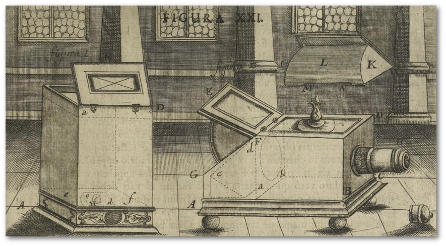

```{=latex}
\hyphenation{
  me-di-en-wis-sen-schaft-li-che
}
```

# Formaler Aufbau

Folgende Hinweise sollen Sie dabei unterstützen, ein formal richtiges und visuell ansprechendes Dokument zu erstellen, das den akademischen Gepflogenheiten des Fachs entspricht.


## Textumfang

Vorbehaltlich abweichender Vorgaben im Rahmen einzelner Lehrveranstaltungen, gelten folgende Richtwerte für den Umfang der Arbeiten. Die Angaben verstehen sich inklusive Leerzeichen und Fußnotenapparat; nicht mitgezählt werden das Deckblatt sowie automatisiert erstellte Inhalte, wie beispielsweise Inhalts-, Abbildungs-, oder Literaturverzeichnis:

* B.&#8239;A.-Module M12, M13, M16: 25&#8239;000 Zeichen
* B.&#8239;A.-Module M19, M20: 40&#8239;000 Zeichen
* M.&#8239;A.-Module: 40&#8239;000 Zeichen
* Bachelorarbeit: 60&#8239;000 Zeichen
* Masterarbeit: 120&#8239;000 Zeichen


## Teile der Arbeit

Feste Bestandteile einer schriftlichen Arbeit sind Titelblatt, Inhaltsverzeichnis, Einleitung, Hauptteil, Schlussbetrachtung und Quellenverzeichnis; fallweise kommen weitere Anhänge (z.&#8239;B. ein Abbildungsverzeichnis) hinzu. Fügen Sie Ihren schriftlichen Arbeiten zudem eine Erklärung zu Redlichkeit und Rechtsfolgenkenntnis bei.


### Deckblatt

Auf Ihrem Deckblatt erfüllen Sie formale Notwendigkeiten hinsichtlich der Angaben zu Ihrer Arbeit und Person. Mit einem aussagekräftigen Titel wecken Sie Interesse an Ihrer Arbeit.

Die nötigen Angaben für schriftliche Arbeiten allgemein und Abschlussarbeiten im Speziellen finden Sie als Muster auf den Seiten ii und iii. Die Gestaltung können Sie natürlich anpassen, die Wiedergabe der jeweiligen Informationen ist jedoch verbindlich.


<!--

| Seminararbeit         |                Abschlussarbeit |
|-----------------------|-------------------------------:|
| Fragestellung/Titel   |            Fragestellung/Titel |
|                       |                    Universität |
|                       |                       Fakultät |
|                       |                      Lehrstuhl |
| Verfasser             |                      Verfasser |
| (Name, Matrikelnr.)   | (Name, Anschrift, Matrikelnr.) |
| Semester              |                                |
| Modul                 |                                |
| Veranstaltung         |                                |
| Lehrperson            |           Erst-/Zweitgutachter |
| FlexNow-Prüfungsdatum |                    Abgabedatum |

-->

### Inhaltsverzeichnis

Nummeriert wird in Form der Dezimalgliederung. Vermeiden Sie mehr als drei nummerierte Gliederungsebenen. Ein Muster finden Sie auf Seite iv. Es empfiehlt sich, die Gliederung der Arbeit automatisiert mithilfe des verwendeten Textverarbeitungsprogramms zu erstellen.


### Einleitung

Die Einleitung ist integraler Bestandteil der Arbeit und soll dem Lesenden/Prüfenden die Forschungsfrage, den Gegenstand der Arbeit und die Methodik aufzeigen; das Ziel der Arbeit sowie der inhaltliche Aufbau werden hier erläutert.


### Hauptteil

Der Aufbau des Hauptteils Ihrer Arbeit ergibt sich aus Frage- oder Aufgabenstellung. Verwenden Sie *sprechende Überschriften*, d.&#8239;h. auf den Inhalt des jeweiligen Abschnitts hinweisende Überschriften; keine Überschriften wie *Hauptteil* oder *Kapitel 1*.

### Schluss

Im Schluss Ihrer Arbeit führen Sie Ihre Ergebnisse zusammen. Hier besteht zudem Raum für Ausblicke und weitere, kritische Kontextualisierung. Auch hier sollte die Überschrift dem Inhalt nach gewählt werden (bspw. Re­sü­mee, Zusammenfassung, Ausblick …).

### Quellenverzeichnis

Hier werden alle in Ihrer Arbeit verwendeten Werke mit deren bibliografischen Details verzeichnet. Alle Quellen sind von Ihnen auf deren Geeignetheit hin überprüft und ausgewählt worden. Die Einträge dienen der Überprüfbarkeit und sprechen für Ihre akademische Sorgfalt. Die Zitierrichtlinien dazu finden Sie unter Punkt 2, das Musterbeispiel ab Seite 11.


### Erklärung

Fügen Sie am Ende Ihrer Arbeit eine unterschriebene Erklärung bzgl. Redlichkeit und Rechtsfolgenkenntnis bei. Als verbindliche Vorlage dient die letzte Seite dieser Gestaltungsrichtlinien.

Beachten Sie für Abschlussarbeiten auch immer die Hinweise auf den Seiten des Prüfungssekretariats Geisteswissenschaften unter „Allgemeine Informationen und Bekanntmachungen | Abschlussarbeit“:
<https://www.ur.de/studium/pruefungsverwaltung/geisteswissenschaften>.


## Seitenlayout und Typografisches ^[Weitere Informationen zu orthografisch richtiger und typografisch ansprechender Gestaltung schriftlicher Arbeiten finden sie z.&#8239;B. in „Typokurz -- Einige wichtige typografische Regeln“ bei Bier (2009).]

-   Die Arbeit wird einseitig auf DIN A4-Papier gedruckt.
    Die Seitenränder betragen: oben 3cm, unten 3,8cm,
    links 3,2cm und rechts 3cm.
-   Die Schriftgröße beträgt üblicherweise 12pt.
-   Verwenden Sie 1,2fachen Zeilenabstand.
-   Für den Fließtext verwenden Sie Blocksatz mit
    automatischer Silbentrennung.
-   Überschriften werden grundsätzlich linksbündig gesetzt
    (ohne Blocksatz).
-   Textauszeichnungen, wie beispielsweise Kursivierung
    und Fettdruck, sind so oft wie nötig, jedoch nicht
    inflationär zu gebrauchen.
-   Verwenden Sie vorzugsweise eine Serifenschrift; die [Vollkorn](http://vollkorn-typeface.com/)^[Information und Download der kostenfreien Schrift *Vollkorn* unter: <http://vollkorn-typeface.com/>.] kommt beispielsweise in diesem Dokument zum Einsatz.


# Zitierrichtlinien und Beispiele zur Erstellung des Quellenverzeichnisses

Das Quellenverzeichnis besteht aus einem alphabetisch geordneten Literaturverzeichnis (Bibliografie), das alle Quellen enthält, die mit einer Autoren/innennennung beginnen (neben literarischen Werken z.&#8239;B. auch Musikvideos, Texte aus dem Internet oder Werbung) und je nach weiteren verwendeten Quellen einem Bildverzeichnis, einem Filmverzeichnis etc. (typischerweise Quellen, die die nicht mit einer/m Autor/in sondern einem Titel beginnen, eben z.&#8239;B. Bilder, Fotos oder Filme).

Den Aufbau eines Quellenverzeichnisses, unter Verwendung aller hier im Text genannten Beispiele, finden Sie ab Seite 11.


## Allgemeines zur Zitation

>„Jede von anderen Autoren wörtlich in die eigene Arbeit übernommene Textpassage und jede sich an die Gedankengänge anderer Autoren eng anlehnende Stelle der Arbeit ist **einzeln** zu kennzeichnen und durch eine **genaue Quellenangabe** zu belegen. [...] Wer einen fremden Text **wörtlich** oder **sinngemäß** in seine wissenschaftliche Arbeit übernimmt, ohne ihn entsprechend zu markieren, macht sich des **Plagiates** schuldig [...].“^[Brink (2013, S.&#8239;195); Hervorhebungen im Original.]

Grundsätzlich lassen sich zwei Arten von Zitaten unterscheiden: das wörtliche oder direkte Zitat und das indirekte Zitat (Paraphrase). Sollten wörtliche Zitate über mehr als drei Zeilen gehen, werden diese links eingerückt und mit geringerem Schriftgrad (10pt) gesetzt.

Sind bei einer/m Autor/in mehrere Werke im selben Jahr zu verzeichnen wird sowohl im Kurz- als auch im Vollbeleg der Jahreszahl ein alphabetisch fortlaufender Kleinbuchstaben-Index zugefügt. Wurde ein Werk von mehr als drei Autoren/innen verfasst, wird im Kurzbeleg die/der Hauptautor/in genannt und weitere Koautoren/innen unter „et al.“ zusammengefasst.

Die Belege werden als **Kurzbeleg** in eine Fußnote geschrieben, bei Bildern direkt in die Abbildungsbeschriftung integriert. Der dazugehörige **Vollbeleg** wird am Ende der Arbeit in einem **Quellenverzeichnis** geführt.

Die Anleitung zur korrekten Darstellung von Kurz- und Vollbeleg der verwendeten Quellen finden Sie im folgenden Teil der Gestaltungsrichtlinien. Den beispielhaften Aufbau eines Quellenverzeichnisses finden Sie ab Seite 11. Dabei gilt, Quellen, die nicht mit einer/m Autor/in sondern einem Titel beginnen (z.&#8239;B. Bilder und Filme) sind alphabetisch unter einer eigenen Rubrik zu führen.


## Fußnoten

In Fußnoten sollen, neben weiterführenden Gedanken, die dort auch ihren Platz finden können, die Kurzbelege Ihrer verwendeten Quellen mit den passenden Seitenangaben zu finden sein. Wird von Ihnen nicht wörtlich zitiert, sondern paraphrasiert, machen Sie dies im Kurzbeleg auch deutlich und stellen diesem ein „Vgl.“ voran.

Sie finden im Folgenden bei allen im Zitierstil beschriebenen Arten von Quellen die dazugehörige Form des Kurztitels für die Fußnoten.

Alle Fußnoten beginnen mit einem Großbuchstaben und werden mit einem Punkt abgeschlossen. Für die genaue Platzierung der Verweisziffer im Text gilt folgende Regel:

> „Bezieht sich die Fußnote auf ein einzelnes Wort oder eine Wortgruppe, steht die Fußnotenziffer direkt dahinter noch vor einem folgenden Satzzeichen. Wenn sie sich jedoch auf einen ganzen Satz oder durch Satzzeichen eingeschlossenen Satzteil bezieht, steht sie nach dem schließenden Satzzeichen.“^[Andermann; Drees & Grätz (2000, S.&#8239;99).]

\clearpage
\pagebreak

## Bildverwendung

Allgemein werden Abbildungen im Kurz- und Vollbeleg, je nach Quelle der sie entnommen wurden, im Quellenverzeichnis geführt.

{width=51%}

Fotografien und Gemälde werden im Kurz- und Vollbeleg nach Punkt 2.4.10 zitiert.

{width=51%}

Stills aus Filmen werden im Kurz- und Vollbeleg nach Punkt 2.4.11 zitiert.

In der Bildunterschrift wird die verwendete Abbildung (Bild, Foto, Gemälde oder Still) beschrieben und um den Kurzbeleg ergänzt (Vgl. Abbildung 1 und 2).

Bei einer größeren Anzahl von Abbildungen können Sie der Übersichtlichkeit halber ein eigenes Abbildungsverzeichnis erstellen. Dort werden die laufende Abbildungsnummer, die ggf. gekürzte Bildunterschrift und die Seitenangabe genannt. Es ersetzt nicht den Nachweis des Werks im Bildverzeichnis, in welchem der Vollbeleg anzugeben ist.


## Zitierstil

Die folgenden Beispiele bieten einen Überblick über häufig genutzte Quellentypen. Verwenden sie Quellenarten, welche hier nicht aufgeführt werden, versuchen Sie diese entlang des hier vermittelten Stils zu verzeichnen.

### Monografie

\kurz Vgl. Dotzler & Roesler-Keilholz (2017, S.&#8239;22).

\bibstart

\voll Dotzler, Bernhard J. & Roesler-Keilholz, Silke (2017). *Mediengeschichte als Historische Techno-Logie*. Baden-Baden: Nomos.

\bibend


### Herausgeberschaft

\kurz Heibach & Rohde (2015).

\bibstart

\voll Heibach, Christiane & Rohde, Carsten (Hg.) (2015). *Ästhetik der Materialität* (=&#8239;HfG Forschung, 6). München: Fink.

\bibend


### Wissenschaftliche Fachzeitschrift

\kurz Stegbauer & Rausch (2001, S.&#8239;48).

\bibstart

\voll Stegbauer, Christian & Rausch, Alexander (2001). Die schweigende Mehrheit -- „Lurker“ in internetbasierten Diskussionsforen. In: *Zeitschrift für Soziologie.* 30, Nr.&#8239;1, S.&#8239;48--64.

\bibend


### Sammelband

\kurz Vgl. Gerhards & Neidhardt (1993, S.&#8239;60).

\bibstart

\voll Gerhards, Jürgen & Neidhardt, Friedhelm (1993). Strukturen und Funktionen moderner Öffentlichkeit. In: Langenbucher, Wolfgang R. (Hg.). *Politische Kommunikation. Grundlagen, Strukturen, Prozesse* (= Studienbücher zur Publizistik- und Kommunikationswissenschaft, 2). 2., überarb. Auflage. Wien: Braumüller. S.&#8239;52--89.

\bibend


\kurz Amento et al. (2003, S.&#8239;60).

\bibstart

\voll Amento, Brian; Terveen, Loren G.; Hill, William C.; Hix, Deborah & Schulman, Robert S.&#8239;(2003). Experiments in social data mining: The TopicShop system. In: *ACM Transactions on Computer-Human Interaction (TOCHI)*. 10, Nr.&#8239;1, S.&#8239;54--85.

\bibend


### Webseite

\kurz O'Reilly (2005).

\bibstart

\voll O'Reilly, Tim (2005). *What Is Web 2.0. Design Patterns and Business Models for the Next Generation of Software*. [url:]{.smallcaps} <https://www.oreilly.com/pub/a/web2/archive/what-is-web-20.html> -- Zugriff: 29.6.2019.

\bibend


### Wikipedia

\kurz Vgl. Wikipedia (2019).

\bibstart

\voll Wikipedia (11. Juli 2019). Universität Regensburg. In: *Wikipedia, Die freie Enzyklopädie*. [url:]{.smallcaps} <https://de.wikipedia.org/w/index.php?title=Universit%C3%A4t_Regensburg&oldid=190335453> -- Zugriff: 22.7.2019.

\bibend

Die bibliografischen Informationen zum verwendeten Wikipedia-Eintrag finden Sie auf der dazugehörigen Webseite unter „Artikel zitieren“. Als Datum des Artikels verwenden Sie den dort genannten „letzten Bearbeitungsstand“, als [url]{.smallcaps} den dort ersichtlichen „Permanentlink“.


### Video und Musikvideo

\kurz Cook (2013).

\bibstart

\voll Cook, Shelby \[XxSourGummyBearzxX\] (16.12.2013). *Tom Hiddleston Funny Moments*. \[Video\]. [url:]{.smallcaps} <https://youtu.be/kXViNegXPTk> -- Zugriff: 22.7.2019.

\bibend

Bei Musikvideos, wie im folgenden Beispiel, wird der Vollbeleg zusätzlich um Regisseur und Label erweitert.

\kurz Björk (1999).

\bibstart

\voll Björk (1999). *All is full of love*. Chris Cunningham; Electra Entertainment Group Inc. [Musikvideo]. [url:]{.smallcaps} <https://www.youtube.com/watch?v=d2tBhaVEWGM> -- Zugriff: 22.7.2019.

\bibend


### Werbung

\kurz Doppelherz (2007).

\bibstart

\voll Doppelherz (2007). *Sitznachbar*. ARD: Radio-Kreativ-Wettbewerb 2007, Broschüre und CD-Rom. \[Werbung\].

\bibend

\kurz Gesellschaft zur Förderung der Photographie (1952).

\bibstart

\voll Gesellschaft zur Förderung der Photographie (1952). Oh die herrlichen Berge. In: *Regensburger Archiv für Werbeforschung.* PROPHOTO vom 12.7.1952, HWA\_1\_863.mp3, R-Nummer: 616. [Werbung, Audio]. [url:]{.smallcaps} <https://raw.uni-regensburg.de/details.php?r=616> − Zugriff: 18.9.2013.

\bibend


### Bild/Gemälde und Fotografie

\kurz _Mann und Frau den Mond betrachtend_ (1818--1824).

\bibstart

\voll _Mann und Frau den Mond betrachtend [Mann und Frau in Betrachtung des Mondes]_ (1818--1824). Caspar David Friedrich. Alte Nationalgalerie Berlin [Öl auf Leinwand]. In: Wikipedia, Die freie Enzyklopädie. [url:]{.smallcaps} <https://de.wikipedia.org/wiki/Datei:Caspar_David_Friedrich_-_Mann_und_Frau_in_Betrachtung_des_Mondes_-_Alte_Nationalgalerie_Berlin.jpg> -- Zugriff: 22.07.2019.

\bibend

\kurz _Larmes_ (Man Ray, 1930).

\bibstart

\voll _Larmes [Tränen]_ (1930). Man Ray. In: Rosalind Krauss & Jane Livingston (Hg.) (1985). L'amour fou. Photography and Surrealism. Washington: Abbeville Press. S.&#8239;118.

\bibend

### Film

\kurz _A Woman's Face_ (US 1941).

Bei Stills oder Ausschnitten mit Timecode:

\kurz _A Woman's Face_ (US 1941, 00:45:18).

\bibstart

\voll _A Woman's Face [Die Frau mit der Narbe]_ (US 1941). Georges Cukor. MGM [DVD/2017]

\bibend

## Software zur Literaturverwaltung

Siehe dazu das Dokument [„Hinweise zur Wissensorganisation und Literaturverwaltung“](https://www.uni-regensburg.de/sprache-literatur-kultur/medienwissenschaft/studium/materialien/index.html).


\clearpage
\pagebreak

# Quellenverzeichnis {-}

## Literaturverzeichnis {-}

\bibstart

Amento, Brian; Terveen, Loren G.; Hill, William C.; Hix, Deborah & Schulman, Robert S. (2003). Experiments in social data mining: The TopicShop system. In: *ACM Transactions on Computer-Human Interaction (TOCHI)*. 10, Nr.&#8239;1, S.&#8239;54--85.

Andermann, Ulrich; Drees, Martin & Grätz, Frank (2000). *Duden. Wie verfasst man wissenschaftliche Arbeiten? Ein Leitfaden für das Studium und die Promotion*. Mainz: Verlag Hermann Schmidt.

Bier, Christoph (2009). Typokurz -- Einige wichtige typografische Regeln. [url:]{.smallcaps} <https://zvisionwelt.files.wordpress.com/2012/01/typokurz.pdf> -- Zugriff: 29.6.2019.

Brink, Alfred (2013). *Anfertigung wissenschaftlicher Arbeiten. Ein prozessorientierter Leitfaden zur Erstellung von Bachelor-, Master- und Diplomarbeiten*. 4., korr. und akt. Auflage. Wiesbaden: Springer Fachmedien.

Doppelherz (2007). *Sitznachbar*. ARD: Radio-Kreativ-Wettbewerb 2007, Broschüre und CD-Rom. \[Werbung\].

Dotzler, Bernhard J. & Roesler-Keilholz, Silke (2017). *Mediengeschichte als Historische Techno-Logie*. Baden-Baden: Nomos.

Gerhards, Jürgen & Neidhardt, Friedhelm (1993). Strukturen und Funktionen moderner Öffentlichkeit. In: Langenbucher, Wolfgang R. (Hg.). *Politische Kommunikation. Grundlagen, Strukturen, Prozesse* (=&#8239;Studienbücher zur Publizistik- und Kommunikationswissenschaft, 2). 2., überarb. Auflage. Wien: Braumüller. S.&#8239;52--89.

Gesellschaft zur Förderung der Photographie (1952). Oh die herrlichen Berge. In: *Regensburger Archiv für Werbeforschung.* PROPHOTO vom 12.7.1952, HWA\_1\_863.mp3, R-Nummer: 616. [Werbung, Audio]. [url:]{.smallcaps} <https://raw.uni-regensburg.de/details.php?r=616> − Zugriff: 18.9.2013.

Heibach, Christiane & Rohde, Carsten (Hg.) (2015). *Ästhetik der Materialität* (=&#8239;HfG Forschung, 6). München: Fink.

O'Reilly, Tim (2005). What Is Web 2.0. Design Patterns and Business Models for the Next Generation of Software. [url:]{.smallcaps} <https://www.oreilly.com/pub/a/web2/archive/what-is-web-20.html> -- Zugriff: 29.6.2019.

Stegbauer, Christian & Rausch, Alexander (2001). Die schweigende Mehrheit -- „Lurker" in internetbasierten Diskussionsforen. In: *Zeitschrift für Soziologie*. 30, Nr.&#8239;1, S.&#8239;48--64.

Wikipedia (11. Juli 2019). Universität Regensburg. In: *Wikipedia, Die freie Enzyklopädie*. [url:]{.smallcaps} <https://de.wikipedia.org/w/index.php?title=Universit%C3%A4t_Regensburg&oldid=190335453> -- Zugriff: 22.7.2019.

Zahn, Johannes (1685). *Oculus Artificialis Teledioptricus Sive Telescopium*. Würzburg: Quirin Heil.

\bibend

## Bild- und Filmverzeichnis {-}

\bibstart

*A Woman's Face \[Die Frau mit der Narbe\]* (US 1941). Georges Cukor. MGM \[DVD/2017\].

_Larmes [Tränen]_ (1930). Man Ray. In: Rosalind Krauss & Jane Livingston (Hg.) (1985). L'amour fou. Photography and Surrealism. Washington: Abbeville Press. S.&#8239;118.

_Mann und Frau den Mond betrachtend [Mann und Frau in Betrachtung des Mondes]_ (1818--1824). Caspar David Friedrich. Alte Nationalgalerie Berlin [Öl auf Leinwand]. In: Wikipedia, Die freie Enzyklopädie. [url:]{.smallcaps} <https://de.wikipedia.org/wiki/Datei:Caspar_David_Friedrich_-_Mann_und_Frau_in_Betrachtung_des_Mondes_-_Alte_Nationalgalerie_Berlin.jpg> -- Zugriff: 22.07.2019.

\bibend


\clearpage
\pagebreak
\KOMAoptions{headsepline=false}
\chead{}


\addsec*{Erklärung}

Ich habe die Arbeit selbständig verfasst, keine anderen als die angegebenen Quellen und Hilfsmittel benutzt und die Arbeit nicht bereits an einer anderen Hochschule zur Erlangung eines akademischen Grades eingereicht. Gegebenenfalls zu(m) Druckexemplar(en) vorgelegtes digitales Material ist identisch.

Von den möglichen Rechtsfolgen habe ich Kenntnis:

* *Bachelorstudierende:*
[Bachelorprüfungs- und Studienordnung für die Philosophischen Fakultäten I--III der Universität Regensburg](https://www.uni-regensburg.de/studium/pruefungsordnungen/bachelor/philosophische-fakultaeten/) (besonders §22 Abs.&#8239;3 S.&#8239;1, §24 und §29 Abs.&#8239;5).
* *Masterstudierende:*
[Prüfungs- und Studienordnung für den Masterstudiengang Allgemeine und Vergleichende Medienwissenschaft an der Universität Regensburg](https://www.uni-regensburg.de/studium/pruefungsordnungen/magister-master/allgemeine-und-vergleichende-medienwissenschaft/) (besonders §20 Abs.&#8239;4, §26 Abs.&#8239;5 und §29 Abs.&#8239;1).


```{=latex}
\vspace{5\baselineskip}
\noindent
\hfill\rule[0.5ex]{10cm}{0.5pt}

\hfill Ort, Datum \hspace*{5.9cm} Unterschrift
```
